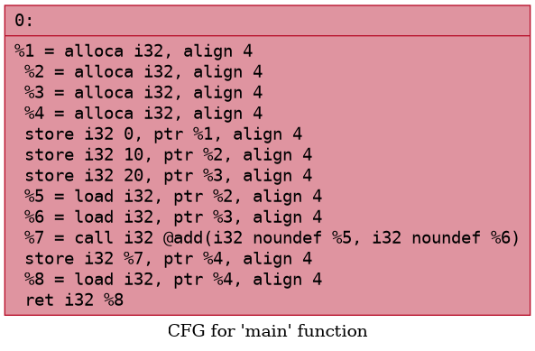
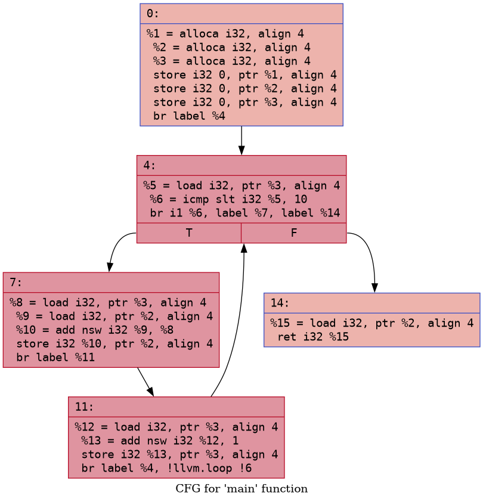

# GPU LLVM Optimizer

## Overview

GPU LLVM Optimizer is a custom LLVM-based analysis framework designed to analyze LLVM IR and extract optimization opportunities from functions and loops. The project provides a modular infrastructure for building compiler analysis passes, loop analysis, and heuristic-based optimization scoring.

The framework is intended for research and experimentation in compiler design, loop optimization, and GPU-oriented performance analysis.

---

## Features

### IR Analysis
- Instruction-level classification
- Load, store, arithmetic, and branch counting
- Function-level statistics extraction

### Loop Analysis
- Loop detection using LLVM LoopInfo
- Loop header identification
- Loop block enumeration
- Loop nesting depth analysis

### Optimization Heuristics
- Loop scoring system (0–100)
- Memory-bound detection
- Vectorization suitability hints
- Loop unrolling suggestions
- Nested loop detection

### Execution Modes
- Standalone analysis tool (`run_pass`)
- LLVM pass plugin (`libMyAnalysisPass.so`)
- IR file processing support

---

## Project Structure

```
gpu-llvm-optimizer/
├── src/
│   ├── analysis/
│   │   └── IRAnalyzer.cpp
│   ├── passes/
│   │   ├── MyAnalysisPass.cpp
│   │   └── run_pass.cpp
├── examples/
│   ├── loop.c
│   ├── loop.ll
│   ├── add.c
│   └── branch.c
├── CMakeLists.txt
├── screenshots/
│   ├── run_pass_output.png
│   ├── loop_analysis.png
│   ├── opt_plugin_output.png
├── README.md
```


---

## Build Instructions

### Prerequisites
- LLVM 21 or compatible version
- Clang / Clang++
- CMake (>= 3.10)

### Build Steps

```bash
mkdir build
cd build
cmake ..
make -j
```

### Running the Analysis Tool

### Run standalone analyzer

```bash
./run_pass ../examples/loop.ll
```

### Expected output
- Function statistics
- Loop detection results
- Loop scoring
- Optimization suggestions

### Running as LLVM Pass Plugin

The build produces:
```bash
libMyAnalysisPass.so
```

### Run using LLVM opt
opt -load-pass-plugin ./libMyAnalysisPass.so \
-passes="function(my-analysis-pass)" \
-disable-output \
../examples/loop.ll

---

## Screenshots

## Demo

The following screenshots show loop analysis and optimization scoring results generated by the LLVM-based analysis pipeline.

### Main CFG (Control Flow Graph)



### Loop CFG



### Optimization Analysis Output


---

## Optimization Model

The system uses a heuristic scoring model for loops based on:

- Number of basic blocks
- Arithmetic intensity
- Memory operations
- Loop nesting depth

The score is used to classify loops as:

- High priority optimization targets
- Vectorization candidates
- Memory-bound loops
- Simple loops suitable for unrolling

---
## Current Limitations
- No interprocedural analysis
- No alias analysis integration
- No SSA-based dependency tracking
- Heuristic scoring only (not cost-model accurate)
- Limited GPU-specific optimization logic
 
---
## Future Work
- Data dependency analysis (SSA-based)
- Loop-carried dependency detection
- Memory access pattern analysis
- Loop transformation passes (unrolling, LICM)
- GPU mapping (OpenCL/CUDA style thread mapping)
- Integration with LLVM optimization pipeline (O1/O2 simulation)

---
## Author

Saumya Gupta

---
## License

This project is for educational and research purposes. Modify and extend freely for learning and experimentation.


